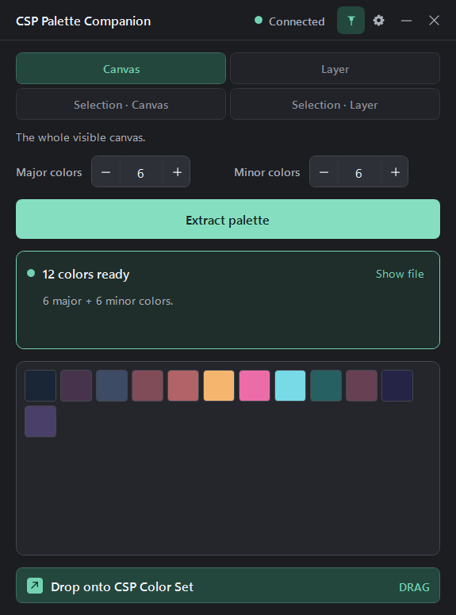
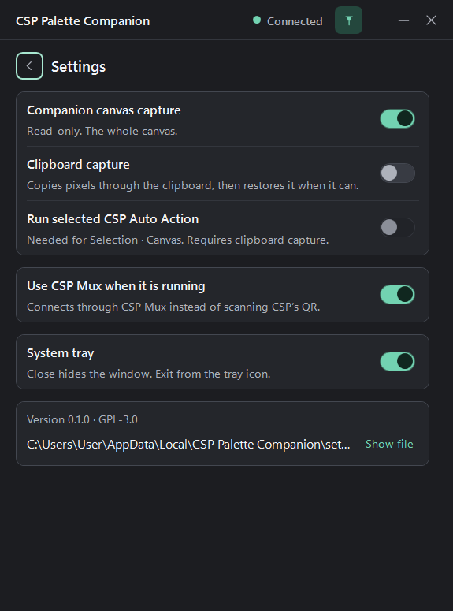
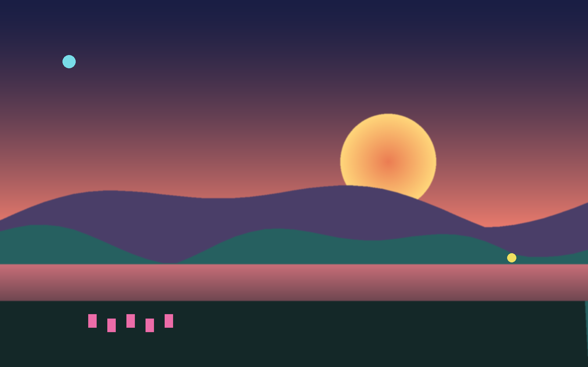
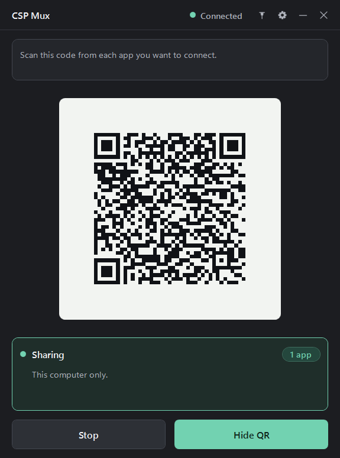

# CSP Palette Companion

Turns a Clip Studio Paint canvas into a Color Set you drag straight back into
CSP. Twelve swatches in a fifth of a second.

Windows 10/11 64-bit. CSP PRO or EX.

## Download

From [releases](https://git.heerlab.com/beasty/csp-color-palette-gen/releases);
no installer.

| File | Size | Needs |
| --- | --- | --- |
| `…-needs-dotnet8.exe` | 2.4 MiB | [.NET 8 Desktop Runtime](https://dotnet.microsoft.com/download/dotnet/8.0) |
| `…-standalone.exe` | 68.8 MiB | nothing |

Take the small one unless you would rather skip the runtime. Antivirus flagged
it? See [Installation](https://git.heerlab.com/beasty/csp-color-palette-gen/wiki/Installation).

## Use it

1. Open your artwork in CSP.
2. `File > Connect to smartphone` (`Datei > Mit Smartphone verbinden`) — a
   toggle, so picking it again turns Companion Mode off. Leave the QR open.
3. Select `Connect`. The dot turns green.
4. Pick a source and your counts (6 major, 6 minor).
5. `Extract palette`. The `.aco` lands under `%LOCALAPPDATA%\CSP Palette Companion`.
6. Drag the green `Drop onto CSP Color Set` bar, not a swatch, onto CSP's Color
   Set palette.

## Sources

| Source | Needs |
| --- | --- |
| Canvas | connection only |
| Layer | clipboard capture, deselect first |
| Selection · Canvas | clipboard capture, [an Auto Action](docs/selection-canvas-setup.md) |
| Selection · Layer | clipboard capture, active selection |

**Before picking an Auto Action:** CSP exposes the command *name* only, never
its recorded steps. The app runs whatever you point it at, unchecked.
[Record one](docs/selection-canvas-setup.md), test it on scrap.

## How the palette is made

Your picture gets shrunk; see-through, near-black and near-white pixels thrown
out — nobody paints with those. The rest go into buckets of look-alike pixels;
each bucket's average is one swatch. Biggest buckets: **major**. Oddballs:
**minor**.

1600x1000, 220 ms, six and six.

**Major** `#1A2535` deep sky · `#48334D` purple ridge · `#3D4B65` sky over ridge
· `#804C58` dusk · `#B26367` water · `#F4B66E` sun

**Minor** `#EC6CA8` pink dots · `#77DAE6` cyan dot · `#276060` green hill ·
`#674153` ridge edge · `#252346` night sky · `#4A3F68` ridge shadow

Those dots are under one percent of the picture — and the two colors an artist
wants. Small and distinct beats large and dull. Same palette every run.
[Technical version](https://git.heerlab.com/beasty/csp-color-palette-gen/wiki/How-Palette-Extraction-Works).

## CSP Mux

CSP accepts one Companion connection;
[CSP Mux](https://git.heerlab.com/beasty/csp-app-multiplexer) re-shares it.
Toggle **Use CSP Mux when it is running** in Settings.

## Build

.NET 8 SDK, Windows only —
[Build from source](https://git.heerlab.com/beasty/csp-color-palette-gen/wiki/Build-from-Source).

[Wiki](https://git.heerlab.com/beasty/csp-color-palette-gen/wiki) ·
[Issues](https://git.heerlab.com/beasty/csp-color-palette-gen/issues) ·
[Notices](THIRD-PARTY-NOTICES.md) · Copyright (C) 2026 beasty,
[GPL-3.0](LICENSE).
