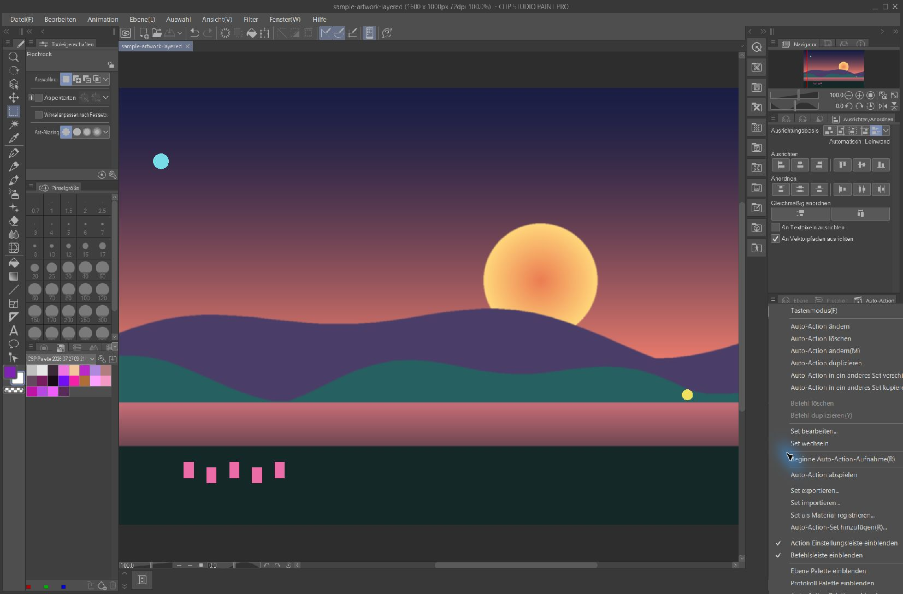

# Selection · Canvas Auto Action

**Recommended:** import the tested Auto Action set instead of recording it
yourself.

- [Download the `.laf` set](assets/CSP_Palette_Companion.laf)
- [Download the complete ZIP](assets/CSP_Palette_Companion_AutoAction.zip)

The imported action is named **Sichtbare Ebenen kopieren**. It creates a
temporary merged copy of all visible layers, copies it to the clipboard, and
deletes the temporary layer again. The original layer stack stays unchanged.

## Import the ready-made set

1. In Clip Studio Paint, open **Window > Auto Action**
   (*Fenster > Auto-Aktion*).
2. Open the palette menu and choose **Import set…** (*Set importieren…*).
3. Select `CSP_Palette_Companion.laf`.
4. Run **Sichtbare Ebenen kopieren** once on a disposable document and paste
   the clipboard contents to verify it.

## Add it to Palette Companion

Companion Mode can run commands registered in **Quick Access**, but it cannot
inspect their recorded steps.

1. Open **Window > Quick Access** (*Fenster > Schnellzugriff*).
2. Drag **Sichtbare Ebenen kopieren** from Auto Action into a Quick Access set.
3. Connect CSP Palette Companion.
4. In **Settings**, enable **Clipboard capture** and
   **Run selected CSP Auto Action**.
5. Select **Refresh CSP actions**, then choose
   **Sichtbare Ebenen kopieren**.

> CSP exposes only the command name over Companion Mode. The app cannot prove
> what a selected Auto Action does, so test this action on a disposable
> document before using it on artwork.

## Rebuild it manually

Start with a document that has several clearly named, visible layers.

Open the **Auto Action** palette and create a new action named
**Sichtbare Ebenen kopieren**.

Start recording.

Record exactly these three commands, in this order:

| # | English | German |
| --- | --- | --- |
| 1 | Layer > Merge visible to new layer | Ebene > Kopien sichtbarer Ebenen kombinieren |
| 2 | Edit > Copy | Bearbeiten > Kopieren |
| 3 | Layer > Delete layer | Ebene > Ebene löschen |

Stop recording. The finished action must contain exactly the three steps shown
below.

## Use it

Select a region in CSP, choose **Selection · Canvas**, then
**Extract palette**. The app focuses CSP, runs the selected Auto Action, reads
the clipboard, and restores the previous clipboard contents.

## Troubleshooting

| Symptom | Fix |
| --- | --- |
| **Refresh CSP actions** is empty, or the action is missing | Connect first and make sure the action is in a Quick Access set. |
| **Selection · Canvas** is disabled | Enable both capture toggles and select one Auto Action. |
| The palette covers the whole canvas | No selection was active. CSP does not expose selection state. |
| A merged layer remains, or CSP waits for input | A step is missing, extra, or requires confirmation. Import the tested set again or re-record it. |
| The command is no longer enabled | Add it to Quick Access again, refresh, and re-select it. |
