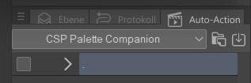
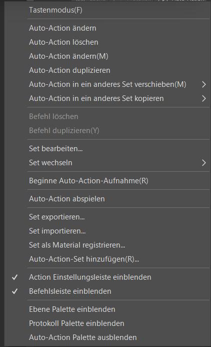
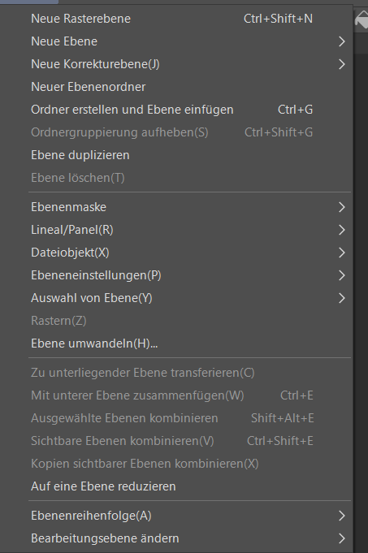

# Selection · Canvas Auto Action

Companion Mode cannot ask CSP what your selection is, so **Selection · Canvas**
triggers a Quick Access command that copies the merged visible pixels inside it
to the clipboard. You record that command once.

> **CSP exposes only a command's name over Companion Mode, never its recorded
> steps. The app cannot verify what the action you pick does.** One that
> flattens the document or exports a file will be run the same way. Record the
> action below, test it, pick that one.

Menu paths: English, German in parentheses. Start with a scrap document open,
Companion Mode on (**File > Connect to smartphone** / *Datei > Mit Smartphone
verbinden…*) and the app connected.

## Part 1 — Record the action

**Window > Auto Action** (*Fenster > Auto-Aktion*).

Add an action to a set. Name it for a command list — `Palette Companion
selection`, not `Action 1`.

Select the record button. Everything from here is captured.

Run these three commands in order, nothing else.

| # | English | German |
| --- | --- | --- |
| 1 | Layer > Merge visible to new layer | Ebene > Kopien sichtbarer Ebenen kombinieren |
| 2 | Edit > Copy | Bearbeiten > Kopieren |
| 3 | Layer > Delete layer | Ebene > Ebene löschen |

Step 2 copies only what is inside the selection; step 3 undoes step 1.

Stop recording and expand the action: exactly three steps, in that order.

Test it: layer stack and selection unchanged, pasting gives the selected region,
merged.

## Part 2 — Add it to Quick Access

Companion Mode sees Quick Access commands only. Open **Window > Quick Access**
(*Fenster > Schnellzugriff*), drag the action onto a set.

## Part 3 — Point the app at it

In **Settings**, enable **Clipboard capture** and **Run selected CSP Auto
Action**, select **Refresh**, then choose your action.

## Using it

Select a region in CSP, choose **Selection · Canvas**, **Extract palette**. The
app focuses CSP, runs the command, reads the clipboard, and restores text,
bitmaps and file drops.

## Troubleshooting

| Symptom | Fix |
| --- | --- |
| **Refresh** empty, or the action missing | Connect first; the action must be in a Quick Access set. |
| **Selection · Canvas** greyed out | Both toggles on, one action chosen. |
| The palette covers the whole canvas | No selection was active. CSP cannot be asked whether one exists. |
| A layer is left behind, or CSP hangs | A step is missing, extra, or needs confirmation. Re-record. |
| The command is no longer enabled | It left Quick Access. Re-register, Refresh, re-select. |
